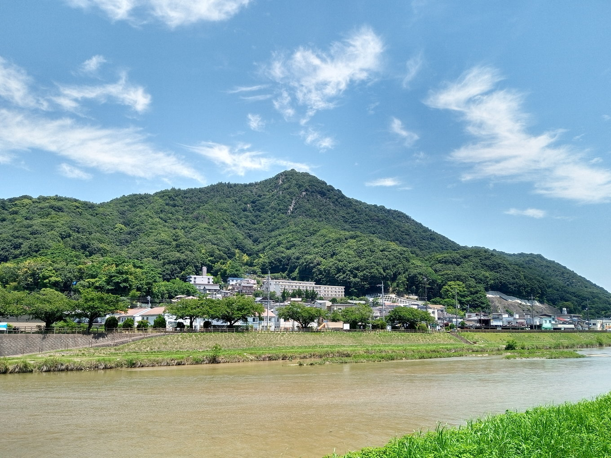
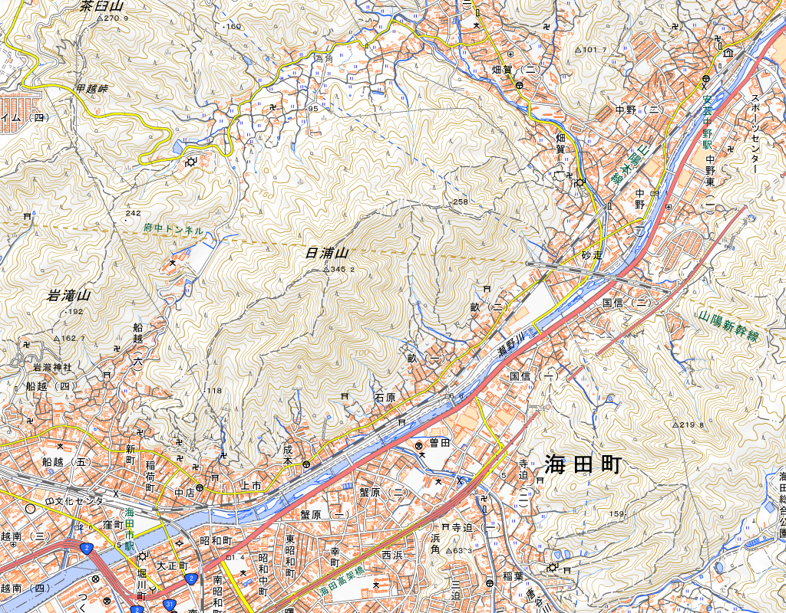

# 日浦山とは

日浦山は、広島県安芸郡海田町にある、標高345mの山だ。

<figure>
  
  <figcaption>2021-06-21 瀬野川越しに見る、日浦山</figcaption>
</figure>

最寄りの駅は、JR山陽本線の海田市駅。呉線とも接続している。
主要駅からの所要時間は…

- 広島駅から9分
- 西条駅から30分
- 呉駅から30分

<figure>
  
  <figcaption>JR海田市駅が近い</figcaption>
</figure>
