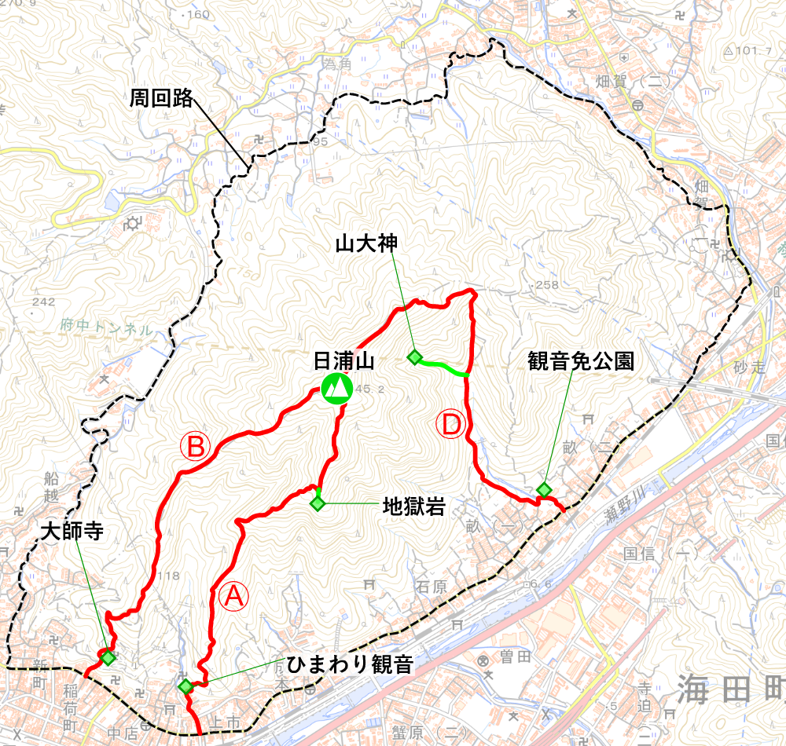

## 日浦山とは

日浦山は、広島県安芸郡海田町にある、標高345mの山だ。山頂からは、海田や広島市の町並みや広島湾が一望できる。登山道はバリエーション豊かで、東西南北、いろんな方向から登ることができる。広島県内では、広島南アルプスや牛田山に次いで登山者が多い(気がする)。

<figure>
  
  <figcaption>2021-06-21 瀬野川越しに見る、日浦山</figcaption>
</figure>

山域は海田町と広島市安芸区にまたがっており、山陽新幹線のトンネルが山中を貫く。足元には、瀬野川が流れている。最寄りの駅は、JR山陽本線と呉線が接続する、海田市駅。主要駅からの所要時間は…

- 広島駅から9分
- 西条駅から30分
- 呉駅から30分

<figure>
  
  <figcaption>JR海田市駅が近い</figcaption>
</figure>

## 山頂

山頂は広く、数十人程度なら楽に収容できる。ベンチや岩が多いので、腰掛けてゆっくり過ごせるだろう(クマバチの多い夏場以外は)。

眺望も良い。海田町や安芸区の町はもちろん、瀬野方面に連なる山並み、安芸アルプスや絵下山、広島湾に浮かぶ島々(江田島、似島、宮島など)、黄金山や広島市中心部などを楽しむことができる。

<figure>
  
  <figcaption>2023-10-19 山頂。この奥にも広がっている</figcaption>
</figure>

<figure>
  
  <figcaption>2023-04-23 山頂から望む海田湾、広島湾</figcaption>
</figure>

<figure>
  
  <figcaption>2023-04-23 絵下山と矢野の町並み</figcaption>
</figure>

## ルートと登山口

日浦山に登る、最も一般的なルートは、

- ひまわり観音から登る**Aルート**
- 大師寺から登る**Bルート**
- 観音免公園から登る**Dルート**

の3つだろう。中でも、Aルートで登ってBルートで下山するのが定番である。どちらも、歩きやすく、迷いにくく、駅近くに登山口がある。

<figure>
  
  <figcaption>メジャールート</figcaption>
</figure>

**Cルート**は無いのか? いや、ある。Cルートは、Dルートと並走する尾根道だが、少々荒れた箇所があり、Yamapやヤマレコではルート認定されてない。しかし全然歩ける。

また、名前付きのルートがもう一つある。**影コース**だ。影ルートではない。「影」というのは、昔の地名だろう。でも登山道の雰囲気も、なんとなく影っぽい。

これら以外に、公式な名前を持たないルートがいくつかある。北側(為角地区)に2本、南側(成本地区)にも2本。支流も合わせれば、もっとあるだろう。

<figure>
  
  <figcaption>マイナールート</figcaption>
</figure>

各ルートについて、別ページで紹介する(予定だ)。

- Aルート
- Bルート
- Cルート
- Dルート
- 影コース
- 上為角地区から登り、Bルートに合流するルート
- 為角地区から登り、Dルートに合流するルート
- 成本地区の配水池から登り、地獄岩に達するルート
- 成本地区の砂防ダムから登り、地獄岩に達するルート

## 見どころ

### 地獄岩

### Aルートのスポット

- ひまわり観音
- 鬼の洗濯岩
- 切株の広場
- 松風の路
- 岩登りの路
- 地獄岩展望ベンチ

### 258mピーク

### 455mベンチ

### 最強鉄塔

### 山大神

### 岩稜帯・チムニー

### 新四国八十八ヶ所霊場

### 唯一のテーブル

## 周辺

### 縦走する

- 蛇幕山、岩滝山
- 蓮華寺山、高城山
- 揚倉山、茶臼山、呉娑々宇山

### 散策する

- 瀬野川河川敷
- 観音免公園

### 学ぶ

- 海田町ふるさと館
- 織田幹雄スクエア

### 参る

- 熊野神社
- 大師寺

### 飲む、食う

- 純(パン屋)
- brique rouge(カフェ)
- 深川珈琲店(喫茶店)
- MOLERS(カフェ)
- 魚食堂たわら

### 停める

- 薬師禅寺
- 海田町ふるさと館

### 用足す

- 海田市駅
- 一貫田公園
- 畝公園
- 成本公園
- 石原公園
- 観音免公園
