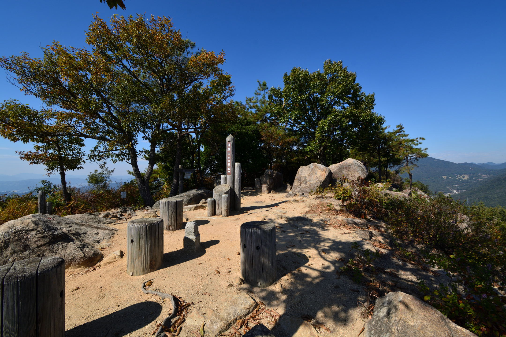
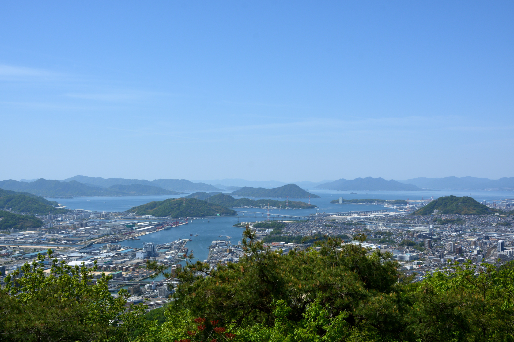
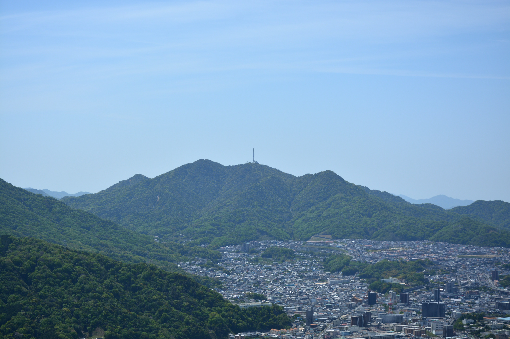
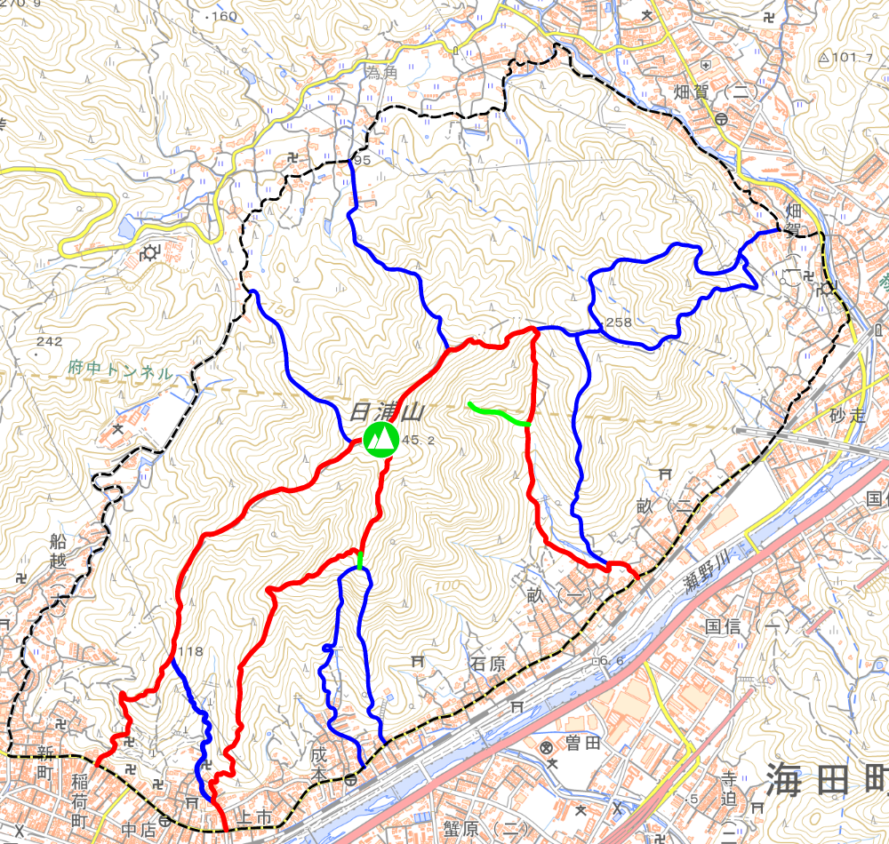

## 日浦山とは

日浦山は、広島県安芸郡海田町にある、標高345mの山だ。山頂からは、海田や広島市の町並みや広島湾が一望できる。登山道も整備されているので、初心者にも登りやすい。

<figure>
  
  <figcaption>2021-06-21 瀬野川越しに見る、日浦山</figcaption>
</figure>

最寄りの駅は、JR山陽本線の海田市駅。呉線とも接続している。主要駅からの所要時間は…

- 広島駅から9分
- 西条駅から30分
- 呉駅から30分

東西に走る山陽新幹線のトンネルが、山中を貫いている。

<figure>
  
  <figcaption>JR海田市駅が近い</figcaption>
</figure>

## 山頂

山頂は比較的広く、数十人程度なら楽に収容できる。ベンチや岩が多いので、腰掛けてゆっくり過ごせるだろう(クマバチの多い夏場以外は)。時々、足元を通過する新幹線も見える。

眺望も良い。海田町や安芸区の町はもちろん、瀬野方面に伸びる山並み、安芸アルプスや絵下山、広島湾に浮かぶ島々(江田島、似島、宮島など)、黄金山や広島市中心部などを楽しむことができる。

<figure>
  
  <figcaption>山頂から望む海田湾、広島湾</figcaption>
</figure>

<figure>
  
  <figcaption>絵下山と矢野の町並み</figcaption>
</figure>

<figure>
  
  <figcaption>安芸アルプス</figcaption>
</figure>

## ルートと登山口

日浦山に登る、最も一般的なルートは、

- ひまわり観音から登るAルート
- 大師時から登るBルート
- 観音免公園から登るDルート

の3つだろう。中でも、Aルートで登ってBルートで下山するのが定番である。どちらのルートも良く整備されており、駅にも近い。

その他にも、まぁまぁ歩きやすいルートやバリエーションルートがいくつかある。

- 影地区から登る影コース(Dルートに合流)
- 上為角地区から登り、Bルートに合流するルート
- 為角地区から登り、Dルートに合流するルート
- 観音免公園から登るCルート(Dルートに合流)
- 成本地区の配水池から尾根を登り、Aルートに合流するルート
- 成本地区の配水池から岩稜帯(アルペンルート)を登り、Aルートに合流するルート
- 成本地区の砂防ダムから谷筋を登り、Aルートに合流するルート
- 奥之谷川の砂防ダムから上り、すぐBルートに合流するルート

<figure>
  
  <figcaption>登山道</figcaption>
</figure>

## アクセス
