## 日浦山とは

日浦山は、広島県安芸郡海田町にある、標高345mの山だ。山頂からは、海田や広島市の町並みや広島湾が一望できる。登山道はバラエティにとみ、360度いろんな方向から登ることができる。広島県内では、広島南アルプスや牛田山に次いで登山者が多い(気がする)。

<figure>
  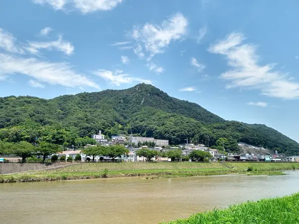
  <figcaption>2021-06-21 瀬野川越しに見る、日浦山</figcaption>
</figure>

山域は海田町と広島市安芸区にまたがっており、山陽新幹線のトンネルが山中を貫く。足元には、瀬野川が流れている。最寄りの駅は、JR山陽本線と呉線が接続する、海田市駅。主要駅からの所要時間は…

- 広島駅から9分
- 西条駅から30分
- 呉駅から30分

<figure>
  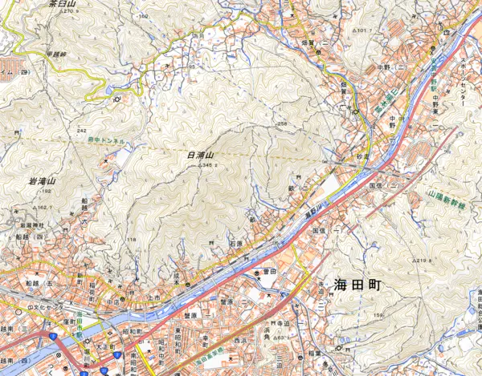
  <figcaption>JR海田市駅が近い</figcaption>
</figure>

## 山頂

山頂は広く、数十人程度なら楽に収容できる。ベンチや岩が多いので、腰掛けてゆっくり過ごせるだろう(クマバチの多い夏場以外は)。

眺望も良い。海田町や安芸区の町はもちろん、瀬野方面に連なる山並み、安芸アルプスや絵下山、広島湾に浮かぶ島々(江田島、似島、宮島など)、黄金山や広島市のビル群などを楽しむことができる。

<figure>
  
  <figcaption>2023-10-19 山頂。この奥にも広がっている</figcaption>
</figure>

<figure>
  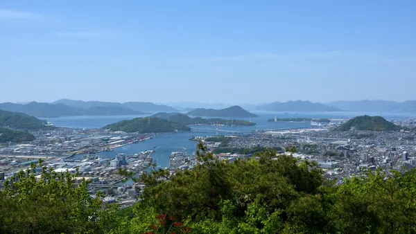
  <figcaption>2023-04-23 山頂から望む海田湾、広島湾</figcaption>
</figure>

<figure>
  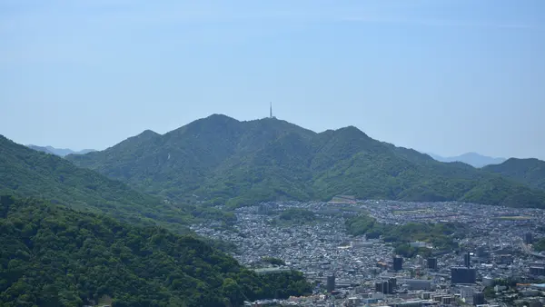
  <figcaption>2023-04-23 絵下山と矢野の町並み</figcaption>
</figure>

## ルートと登山口

日浦山に登る、最も一般的なルートは、

- ひまわり観音から登る**Aルート**
- 大師寺から登る**Bルート**
- 観音免公園から登る**Dルート**

の3つだろう。中でも、Aルートで登ってBルートで下山するのが定番である。どちらも、歩きやすく、迷いにくく、駅近くに登山口がある。

<figure>
  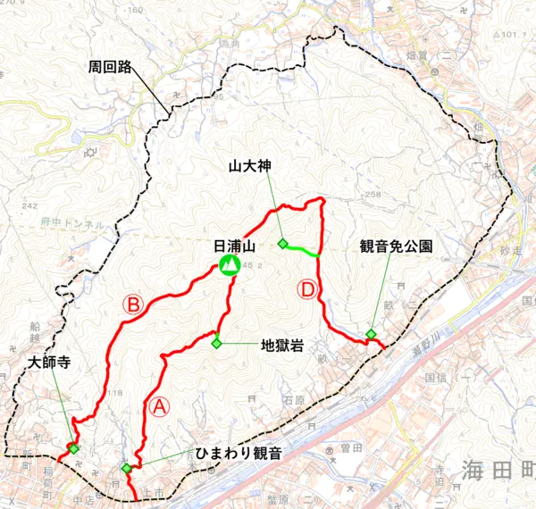
  <figcaption>メジャールート</figcaption>
</figure>

**Cルート**は無いのか? いや、ある。Cルートは、Dルートと並走する尾根道だが、少々荒れた箇所があり、Yamapやヤマレコではルート認定されてない。しかし全然歩ける。

また、名前付きのルートがもう一つある。**影コース**だ。影ルートではない。「影」というのは、昔の地名に由来するようだ。登山道の雰囲気も、なんとなく影っぽい。

これら以外に、公式な名前を持たないルートがいくつかある。北側(為角地区)に2本、南側(成本地区)にも2本。支流も合わせれば、もっとあるだろう。

<figure>
  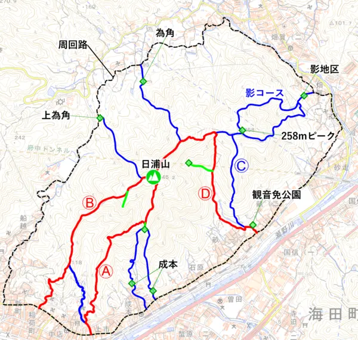
  <figcaption>マイナールート</figcaption>
</figure>

各ルートについて、別ページで紹介する(予定だ)。

- Aルート
- Bルート
- Cルート
- Dルート
- 影コース
- 上為角地区から登り、Bルートに合流するルート
- 為角地区から登り、Dルートに合流するルート
- 成本地区の配水池から登り、地獄岩に達するルート
- 成本地区の砂防ダムから登り、地獄岩に達するルート

## 見どころ

### 地獄岩

標高250m付近、Aルートから少し南へ逸れた位置にある奇岩。南斜面の岩稜帯の最上部にあたる。下は絶壁なので高度感があり、眺望も良い。

<figure>
  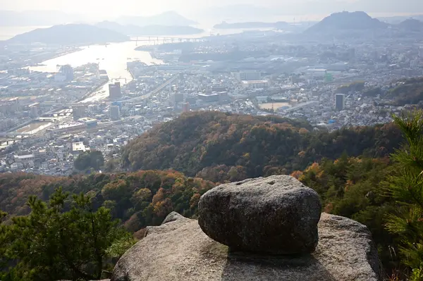
  <figcaption>2022-12-08 地獄岩</figcaption>
</figure>

<figure>
  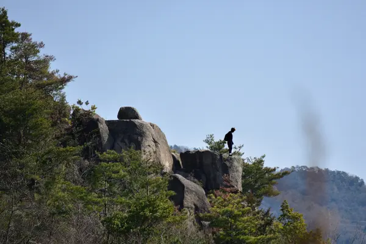
  <figcaption>2026-02-23 足元注意</figcaption>
</figure>

### 455mベンチ

Bルート上、山頂まで455m地点にある展望ベンチ。

<figure>
  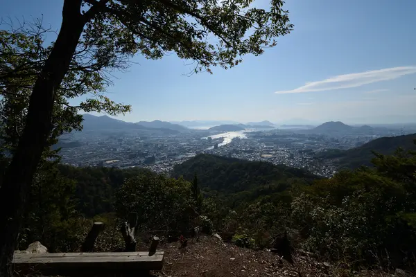
  <figcaption>2023-10-19 (山頂まで)455mの癒やしのベンチ</figcaption>
</figure>

### 258mピーク

影コース上の小ピーク。標高258m。東側が開けており、鉾取山や坂山を望む。

<figure>
  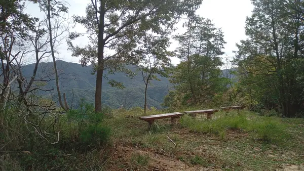
  <figcaption>2022-10-08 258mピークのベンチ</figcaption>
</figure>

### 心臓破りの階段

東側から山頂にアプローチする登山者は、漏れなく通ることになる、急登階段。正確な段数は知らないが、100段くらいある(数えようと思うが、いつも忘れる)。

### 最強鉄塔

### 山大神

### 岩稜帯・チムニー

南側から日浦山を見ると、そそり立つような岩稜帯が目を引く。チムニーと呼んだりするらしい。ここを登るルートもあるようだ。登りきったところに地獄岩がある。

<figure>
  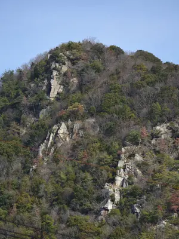
  <figcaption>2026-02-23 岩稜帯</figcaption>
</figure>

### 新四国八十八ヶ所霊場

### 唯一のテーブル

日浦山は、たくさんのベンチが設置された優しい山だが、テーブルは一つしかない。さて、どこでしょう?

<figure>
  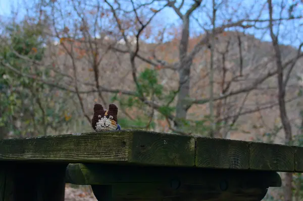
  <figcaption>2024-12-28 The only table</figcaption>
</figure>

※Dルートにもあった気がする(要確認)。

## 周辺

### 縦走する

- 蛇幕山、岩滝山
- 蓮華寺山、高城山
- 揚倉山、茶臼山、呉娑々宇山

### 散策する

- 中国自然歩道
- 瀬野川河川敷
- 観音免公園

### 学ぶ

- 海田町ふるさと館
- 織田幹雄スクエア

### 参る

- 熊野神社
- 大師寺

### 飲む、食う

- 純(パン屋)
- brique rouge(カフェ)
- 深川珈琲店(喫茶店)
- MOLERS(カフェ)
- 魚食堂たわら

### 停める

- 薬師禅寺
- 海田町ふるさと館

### 用足す

- 海田市駅
- 一貫田公園
- 畝公園
- 成本公園
- 石原公園
- 観音免公園
